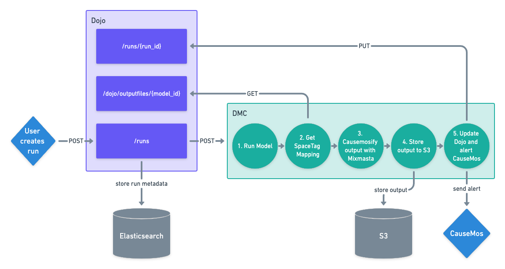

# Dojo
The Domain Modeler Workbench. This repository contains backend infrastructure for executing blackbox models. It is organized into two major components:

1. `dmc`: the Domain Model Controller (DMC), an [Airflow](https://airflow.apache.org/) based execution engine.
2. `api`: the Dojo API, a [FastAPI](https://fastapi.tiangolo.com/) based management and data routing layer

## Model Execution Workflow



## Quickstart

First run DMC with:

```
cd dmc
docker-compose up -d
```
then run the Dojo API with:

```
cd ../api
docker-compose up --build -d
```

## License

-   Free software: MIT license